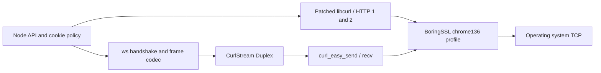

# Design and fidelity boundaries

## Target and implementation choice

The fixed target is **Chromium 136.0.7103.93 as shipped in Chrome on macOS**,
with an en-US language preference. Client hints include Google Chrome branding.
This is a historical target, not a claim to match the current browser. The native
backend is curl-impersonate **v2.2.2**, profile `chrome136`, with its bundled
BoringSSL and patched nghttp2. `client.backend` reports the actual library versions
and install hashes.

Node's standard TLS module uses OpenSSL. It exposes cipher selection, protocol
bounds, SNI and ALPN, but not the full Chromium ClientHello construction and
connection state machinery. Changing User-Agent or cipher order leaves many
differences. A complete implementation of TLS, HPACK, HTTP/2 and WebSockets in
JavaScript is theoretically possible; stock Node networking and existing
JavaScript options do not provide browser equivalence. Reimplementing modern
TLS/ML-KEM securely would be a large, separate project. This app uses compiled
code for TLS and HTTP rather than claiming that native Node TLS is pure JS.
[Node TLS documentation](https://nodejs.org/docs/latest-v24.x/api/tls.html)
and [Chromium's pinned TLS implementation](https://chromium.googlesource.com/chromium/src/+/136.0.7103.93/net/socket/ssl_client_socket_impl.cc)
describe the underlying implementations.

Koffi provides the native FFI boundary. Our binding uses actual C `long`, `size_t`,
pointer and union layouts, retains callbacks/request buffers until completion,
copies bytes from transient native memory, and cleans handles on cancellation.
curl's multi interface supplies connection pooling and HTTP/2 multiplexing. A
2 ms nonblocking poll drives network I/O on the JS thread; DNS initialization and
native processing can still consume event-loop time. There are no worker/browser
processes. Polling costs CPU at scale and is not Chromium's event scheduler.

For WebSockets, libcurl creates a connect-only HTTP(S) connection, including
TLS verification and handshake, then `curl_easy_send/recv` carries the upgrade
and all frames. The handle stays attached to the multi handle until closure,
as required by [CURLOPT_CONNECT_ONLY](https://curl.se/libcurl/c/CURLOPT_CONNECT_ONLY.html).
The Node `http`/`https` serializer used by `ws` receives our already-connected
Duplex through `createConnection`; it never creates a client TLSSocket. The same
BoringSSL library and profile make both HTTPS and WSS connections.

libcurl's built-in WebSocket extension support is insufficient for this target;
using `curl_ws_send/recv` directly would omit permessage-deflate.
[libcurl WebSocket interface](https://curl.se/libcurl/c/libcurl-ws.html).
The pinned `ws` codec handles accept-key verification, subprotocol/extension
validation, client masking, text/binary messages, incoming fragmentation,
ping/pong, UTF-8 validation and close handshakes. We reorder the request before
serialization to follow Chromium's basic WebSocket handshake. Compression offers
`permessage-deflate; client_max_window_bits`, with context takeover unless the
server negotiates otherwise, zlib level 6 and no size threshold. Chromium 136's
predictor always chooses compression and its deflater uses zlib defaults; these
are source-aligned choices, not proof of identical compressed bytes.
[Predictor](https://chromium.googlesource.com/chromium/src/+/136.0.7103.93/net/websockets/websocket_deflate_predictor_impl.cc),
[deflater](https://chromium.googlesource.com/chromium/src/+/136.0.7103.93/net/websockets/websocket_deflater.cc).

## What is covered

| Area | Implemented behavior | Remaining differences / evidence limits |
| --- | --- | --- |
| TLS | BoringSSL chrome136 ciphers, GREASE, permuted extensions, signature algorithms, ML-KEM/X25519 groups/shares, TLS versions, certificate compression and ECH GREASE | Native BoringSSL revision differs from Chromium 136's build. Real ECH DNS config, session-cache partitioning, ticket lifetimes, certificate verification policy, TLS record splitting and timing are not equivalent or fully compared. |
| ALPN | HTTP requests offer h2 then HTTP/1.1; plain HTTP uses HTTP/1.1. WSS uses a dedicated HTTP/1.1 connection through the same TLS backend. | Chromium can reuse WebSocket-capable h2 sessions using RFC 8441. This implementation always uses HTTP/1.1 Upgrade for ws/wss; that changes ALPN/ALPS relative to h2 and is an explicit scope limit. |
| HTTP/2 | Profile SETTINGS values/order, connection WINDOW_UPDATE, pseudo-header order, nghttp2 HPACK, persistent connections and concurrent multiplexing | Wire report records HEADERS flags/priority and HPACK bytes, but the reference lacks enough data to verify them. Scheduling, flow-control updates under load, coalescing, GOAWAY recovery and priority behavior are libcurl/nghttp2 behavior. |
| Headers | Fixed macOS navigation profile, optional fetch context, ordered overrides, Origin, language, encoding, cookie and WebSocket defaults | Chromium defaults vary by destination, initiator, policy, cache state, client hints, field trials and installation. HTTP/1 casing, custom-header placement, redirect tainting and browser-managed headers are not comprehensively compared. No automatic Referer. |
| Cookies | Shared HTTP/WS jar: domain/path/expiry, Secure, HttpOnly, prefixes, public suffixes and schemeful SameSite; missing SameSite becomes Lax; insecure SameSite=None is rejected | No CHIPS/partitioned storage (those cookies are discarded), browser quotas/eviction, third-party settings, full redirect-chain rules, or two-minute Lax+POST compatibility exception. This is not Chromium CookieMonster. |
| Compression | HTTP gzip, deflate, Brotli and zstd decoded natively; ws permessage-deflate negotiated and tested | Encoded output, zlib build, fragmentation choices and rare negotiated window sizes are not compared byte-for-byte with Chromium. Chromium's 4 KiB compression buffering differs from ws's message buffering. |
| Framing | Fresh random mask per client frame, valid lengths/opcodes, control frames, fragmented incoming messages, close codes/reasons | Outgoing frame boundaries, batching, masking distribution, backpressure thresholds and delivery timing differ or remain unvalidated. |
| State and protocols | Direct HTTP(S)/WS(S), pooled HTTP, redirects, deadlines/abort, bounded buffered responses and WS receive queues | No HTTP cache, HSTS store, Alt-Svc state, HTTP/3/QUIC, proxy API, service workers, browser DNS stack, speculative connects, network isolation keys, origin throttling, certificate transparency checks or browser process. |

`context: { kind: 'fetch', initiator }` builds fetch-like headers and cookie
selection. **It does not implement Fetch's CORS/preflight/response filtering,
mixed-content or CSP enforcement.** This is an explicit network client API,
not a browser execution environment. WS API calls take an explicit initiating
origin. Trust roots come from Node's bundled Mozilla roots at setup time or a
supplied CA PEM, not the Chrome Root Store.

Responses are buffered and decompressed before delivery. `headers` retains wire
Content-Length/Content-Encoding; `body.length` is the decoded length. Duplicate
response headers, including Set-Cookie, are preserved as pairs. The header callback
also collects trailers; they are not separately exposed. Text decoding is UTF-8,
not Chromium's full encoding detection.

WebSocket receives drain a bounded queue (16 MiB / 1024 messages by default).
The decoder caps message size at 16 MiB. Exceeding these closes the connection
and rejects receives after queued messages drain. Send resolves once bytes have
been handed through the stream, not when the peer acknowledges receipt. Callers
should await send to apply backpressure. Close allows code 1000 or 3000–4999,
checks the 123-byte reason limit, and waits up to 5 seconds before termination.
`signal` cancels opening; use close/terminate after open.

## Socket.IO integration

`connectSocketIO()` retains the official Socket.IO client and installs our custom
Engine.IO `Transport`. Socket.IO supports passing transport implementations in its
`transports` option. [Official options](https://socket.io/docs/v4/client-options/#transports).
The adapter opens `ChromiumClient.openWebSocket()` and feeds received text/binary
messages to Engine.IO's parser. Outbound batches are copied before asynchronous
encoding/writes, preserving Engine.IO's mutable-buffer and drain semantics.

Socket.IO handles namespace CONNECT/DISCONNECT, auth, events, acknowledgement IDs,
binary attachment reconstruction, reconnect backoff, and Engine.IO heartbeat.
These heartbeats are Engine.IO packets, distinct from WebSocket control ping/pong.
The wrapper forces a fresh Manager and a single native transport to prevent
polling/Node-TLS fallback or reuse of another client's cached Manager.
ChromiumClient continues to own cookies, TLS, extension negotiation and framing.
Native socket options and Socket.IO per-packet compression hints are not forwarded;
compression follows the Chromium WebSocket profile. There is no Engine.IO v3 or
polling support. Users of the adapter must disconnect Socket.IO before closing its
ChromiumClient to stop reconnection attempts.

`JTracker.ts` uses this adapter with `/socket.io/` as the HTTP path and `/` as its
namespace. It uses Chromium 136's User-Agent, accepts test endpoint/CA/origin and
Socket.IO option overrides, exposes the normal `.socket` API, and closes its native
client after giving Engine.IO a bounded opportunity to flush DISCONNECT. Importing
the module has no connection side effects. The CLI handles SIGINT/SIGTERM.

Tests attach a real local Socket.IO server to the controlled TLS endpoint and run
the actual JTracker class through it. They exercise header/TLS observations,
bidirectional acknowledgements, concurrent binary events, heartbeats, reconnect,
namespaces, auth rejection, base64 mode, certificate rejection and manager timeout.
No production JTracker service was contacted for these tests.

## Setup, platforms and native provenance

`npm ci` pins JS packages with registry integrity hashes. `npm run setup` downloads
the platform-specific **v2.2.2 libcurl library archive** from upstream GitHub;
`scripts/native-assets.json` pins its published SHA-256. Setup verifies the archive
before extraction, installs only the library and a CA bundle under `.native`, then
records the library hash in `install.json`. Runtime verifies that hash, BoringSSL
version string, and `curl_easy_impersonate` symbol. Missing setup or impersonation
fails instead of using ordinary libcurl or Node TLS. No downloads happen during
requests. A checksum is integrity evidence, not a reproducible-build attestation.

Prebuilt setup covers macOS arm64/x64 and Linux glibc/musl arm64/x64. Only macOS
arm64 with Node 24.10.0 was run here. Linux assets are pinned but not tested here.
Use Node 24 (22.15+ with zstd also supported), `tar` for setup, and `openssl` for
temporary test certificates. Windows is not supported by the setup script.

For a source build, use the pinned release's build instructions and dependency
pins, including BoringSSL and nghttp2 patches; generic libcurl is insufficient.
Extend the installer to record the resulting library's path/hash and CA bundle.
Re-run comparisons and record that build's provenance before accepting it.
[Upstream build documentation](https://github.com/lexiforest/curl-impersonate/tree/v2.2.2).
The downloaded library's upstream and bundled dependency licenses apply; retain
release license notices when redistributing binaries. We do not commit the
native archive/binary. The reference fixture's license is included in the repo.

## Validation and claim limits

Run `npm test`, then `npm run validate`. Tests create temporary local certificates
and controlled HTTP/TLS/WebSocket endpoints; no Internet service is necessary once
setup is complete. The TLS endpoint is a Node/OpenSSL **server only**. A loopback
TCP relay records TLS bytes before termination. A small independent HTTP/2 endpoint
parses preface, frames and HPACK to preserve observations a high-level server API
would hide. These are test fixtures, not hardened public servers. Tests verify
advertised decompression, cookies/redirects, binary bodies, h2 reuse/concurrency,
certificate rejection for HTTPS and WSS, WebSocket extensions, masking, ping/pong,
fragmented receives, close, timeouts, limits, cancellation and client shutdown.

The comparison uses the vendored upstream Chrome signature and pinned Chromium
WebSocket test assertions. The YAML explicitly says it was manually adapted from
Chrome 131. It is a derived reference, not an independent raw Chrome 136 capture.
The comparator normalizes GREASE values and extension order because Chrome
randomizes them, retaining multiplicity. It checks individual algorithms, groups
and key-share sizes, plus HTTP/2 SETTINGS/window increments and header values/order.
It marks the reference's ECH-length placeholder and absent fields as unvalidated.
It computes no success verdict from JA3/JA4 alone.

`validation/results/latest.json` records actual ClientHello bytes/parsed fields,
HTTP/2 frames/HPACK bytes, WebSocket frames, reference provenance, native versions,
individual comparisons, and unvalidated areas. Those observations come from
**this implementation**, not Chromium. `npm run validate` exits nonzero on a
comparison failure. Passing means only that the checked reference fields match.
Overall browser equivalence remains **NOT ESTABLISHED**.

For stronger validation without running a browser, obtain pre-existing captures
from the exact browser build/OS and known endpoint conditions, with provenance
and TLS key logs for encrypted HTTP/2/frame inspection. Compare separate cold/warm
HTTP/1, h2, WS and WSS sessions, large transfers, resume paths, redirects and
compression negotiations. Extend the fixture/comparator with those observations;
never substitute this app's output for the browser baseline. No browser capture
was supplied here, and none was created by executing a browser.
